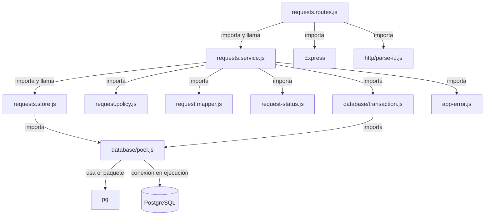

# Cohesión, acoplamiento y dirección de dependencias

Material de lectura y laboratorio para la sección **Cohesión, acoplamiento y dependencias** de la clase 08.

## Lectura 1: Cohesión y acoplamiento

**Clasificación:** lectura interna · **Dificultad:** media · **Tiempo estimado:** 9 minutos

### Cohesión: la pregunta hacia dentro

> ¿Por qué cambiaría este archivo?

Un archivo es cohesivo cuando lo que contiene cambia por la misma razón. Prueba a describirlo en una frase:

- «Contiene las reglas de permisos sobre solicitudes»: una razón; cohesivo.
- «Valida ids y además consulta historial y además decide permisos y además arma el JSON»: varias razones conviviendo; baja cohesión.

Cada «y además» puede señalar una razón de cambio distinta. No es una cuenta mecánica: sirve para detectar responsabilidades que se mueven por motivos independientes.

Dos matices:

- La cohesión no se mide en líneas. Un archivo grande puede tener una sola responsabilidad; uno pequeño puede mezclar varias.
- La cohesión no se logra creando archivos por crear. Hay que agrupar por razón de cambio, no por tamaño ni por capricho.

| Archivo del módulo | Cambia cuando... | Lectura de cohesión |
| --- | --- | --- |
| `request.policy.js` | Cambian las reglas de autorización o permisos sobre requests. | Cohesivo: reglas puras de permiso, sin HTTP ni SQL. |
| `requests.store.js` | Cambian las consultas, parámetros o el esquema PostgreSQL que usa requests. | Cohesivo: acceso a datos, sin status HTTP ni decisiones de permisos. |
| `request.mapper.js` | Cambia la traducción entre filas de base de datos y la representación pública. | Cohesivo: adapta formatos; no consulta ni decide permisos. |
| `requests.routes.js` | Cambian rutas, entradas HTTP o la forma de responder desde Express. | Cohesivo con la frontera HTTP; no debería conocer SQL. |
| `requests.service.js` | Cambia la coordinación de un caso de uso, su validación o su unidad de trabajo. | Es el archivo más amplio: vigila que las reglas sigan siendo de policy y el SQL de store, sin dividirlo automáticamente. |
| `request-status.js` | Cambian estados válidos o transiciones del ciclo de vida. | Cohesivo: modelo de estados, sin infraestructura. |

El handler de historial antes de separarlo —el que motiva el ejercicio— juntaba al menos cuatro razones: validar el id, consultar historial, decidir visibilidad y construir el JSON. En la versión organizada, esas tareas quedan en los límites adecuados: route/parser, service/policy, store y mapper.

### Acoplamiento: la pregunta hacia fuera

> ¿Qué sabe este archivo de los demás y le corresponde saberlo?

Acoplamiento es cuánto conoce un componente de los detalles internos de otro. En este backend serían señales problemáticas:

- Una route lee una columna de PostgreSQL como `row.assigned_to`.
- Una policy recibe el objeto `req` completo de Express para decidir permisos.
- Cambiar el esquema obliga a editar la route porque conoce nombres de columnas.
- Probar una regla de negocio exige levantar Express, migrar la base y sembrar datos.

No todo acoplamiento se elimina. El service necesita conocer la interfaz del store y llamarlo: esa es parte de su trabajo. Puede llamar `findById(id)` sin conocer el `SELECT`, los índices ni la conexión usados por debajo. La route puede llamar al service sin conocer columnas.

La distinción útil es: **depender de una interfaz adecuada está bien; conocer detalles ajenos no.** El desacoplamiento absoluto produce abstracciones e inyecciones sin una necesidad demostrada.

### El termómetro: cuánto cuesta probar

`canClaimRequest({ actor, request })` recibe objetos simples y puede probarse sin servidor ni base. La regla enterrada en un handler obliga a preparar HTTP y persistencia antes de poder observarla. Cuanto más infraestructura necesita una prueba para llegar a una regla, más dependencias arrastra esa regla.

Lo que cuesta probar suele costar cambiar. Cuando una prueba resulta cara, pregunta qué conoce el comportamiento probado y qué podría moverse a un límite más simple.

### Comprobación de lectura

1. **¿Por qué más archivos no implica más cohesión?** Porque dividir por tamaño o por capricho puede separar código que cambia por la misma razón, o crear archivos que no representan una responsabilidad coherente.
2. **Dependencia legítima:** `requests.service.js` llama a `findById` del store. **Conocimiento indebido:** la route interpreta `assigned_to` o arma SQL conociendo el esquema.
3. **¿Qué relación hay entre costo de prueba y acoplamiento?** Una prueba que necesita servidor, base y seed revela que la regla está conectada a infraestructura; aislarla reduce ese costo y limita el impacto de cambios.

### Laboratorio 1: cohesión y acoplamiento (8 casos)

Clasifica cada caso y compara con la solución razonada.

| # | Caso | Clasificación y razón |
| --- | --- | --- |
| 1 | «Este archivo valida ids, consulta historial, decide permisos y arma JSON». | **Baja cohesión:** mezcla al menos cuatro razones de cambio. |
| 2 | `request.policy.js` contiene `canViewHistory` y `canClaimRequest`. | **Cohesivo:** decide reglas de acceso/permiso con datos simples; no conoce Express ni PostgreSQL. |
| 3 | `requests.store.js` contiene `findHistory` con SQL parametrizado. | **Cohesivo:** la consulta y sus detalles de persistencia cambian por motivos de datos/SQL. |
| 4 | `request.mapper.js` convierte `assigned_to` a `assignedTo`. | **Cohesivo:** mantiene la traducción entre fila y representación pública en un solo límite. |
| 5 | La route usa `row.assigned_to` para formar la respuesta. | **Acoplamiento indebido:** HTTP conoce el esquema de base de datos; además mezcla presentación con transporte. |
| 6 | La policy recibe `req` y consulta `req.auth`. | **Acoplamiento indebido:** la regla conoce Express. Debe recibir el actor y el request ya representados como datos. |
| 7 | El service importa `findById` y lo llama con el id. | **Dependencia legítima:** la coordinación del caso necesita pedir datos al store, pero no sabe cómo se ejecuta el SQL. |
| 8 | Una prueba de `canClaimRequest` necesita Express, migración y seed. | **Acoplamiento alto:** la regla no está aislada; con la policy pura actual se prueba con objetos literales. |

## Lectura 2: La dirección de las dependencias

**Clasificación:** lectura interna · **Dificultad:** media · **Tiempo estimado:** 8 minutos

### Qué es una flecha

Una flecha va de A hacia B cuando **A importa o llama a B**. El valor que B devuelve a A no crea una flecha nueva: el retorno viaja por la llamada existente.

Por ejemplo, `requests.routes.js` importa y llama a `getHistory` de `requests.service.js`: route → service. El service devuelve un resultado al route, pero no aparece una flecha service → route.

### Grafo real del módulo

Este grafo recoge los imports/calls de los archivos actuales. La conexión del pool a PostgreSQL es una conexión de ejecución, no un import de JavaScript.

La flecha principal de la lámina es `requests.routes.js` → `requests.service.js` → `requests.store.js` → PostgreSQL. `request.policy.js` queda al costado: el service la consulta y la policy no importa a nadie. El mapper y el modelo de estados también son módulos puros sin imports de infraestructura.

Las dependencias auxiliares actuales no deben ocultarse al dibujar imports: la route también importa `parse-id.js`; el service importa mapper, estados, transacción y `AppError`; tanto store como transacción llegan al pool.

### Por qué importa la dirección

- Si cambia el contrato HTTP, se ajusta la route; el store no debería enterarse.
- Si cambia una columna o consulta, se ajusta el store y posiblemente el mapper; la route no debería conocer el cambio.
- Si cambia un permiso, se ajusta la policy y su prueba pura.
- Si una dependencia apunta hacia arriba —por ejemplo, el store importa la route— se forma un ciclo y ningún archivo se entiende o prueba con facilidad.

La regla no es eliminar todas las flechas. Es hacerlas explícitas, de una sola dirección y coherentes con el trabajo de cada capa.

### Comprobación de lectura

1. **¿Por qué el retorno no cuenta como dependencia?** Porque la dependencia se establece por el import/llamada; el retorno sigue esa misma relación.
2. **¿Qué gana la policy al no importar nada?** Se puede probar como función pura, sin Express, pool, base ni configuración de entorno.
3. **¿Cómo detectar un ciclo?** Dibuja una flecha por cada import/call y busca un camino que regrese al archivo inicial. En el starter, route → service → store no apunta de vuelta a route.

### Laboratorio 2: mapa de dependencias (5 capas)

Dibuja las cinco capas del ejercicio y agrega flechas en la dirección **importa/llama a**:

1. `requests.routes.js`
2. `requests.service.js`
3. `request.policy.js` (al costado del service)
4. `requests.store.js`
5. PostgreSQL (debajo del pool que usa el store)

**Solución del recorrido principal:** `requests.routes.js` → `requests.service.js` → `requests.store.js` → `database/pool.js` → PostgreSQL. Agrega `requests.service.js` → `request.policy.js` como rama lateral. No dibujes una flecha de vuelta por el valor de retorno.

**Checkpoint:** ¿alguna flecha apunta hacia arriba? No entre las cinco capas del recorrido. La policy no tiene flechas de salida; store depende del pool y no de route/service. En el grafo ampliado, mapper, estado, parser, transacción y error también son dependencias salientes, detalladas arriba.

### Actividad aplicada

Abre los imports de los archivos de `src/modules/requests/` y completa este resumen:

| Archivo | Importa/conoce principalmente a | ¿Flecha correcta? |
| --- | --- | --- |
| `requests.routes.js` | Service, parser de id, Express | Sí: frontera HTTP hacia operaciones/validación. |
| `requests.service.js` | Store, policy, mapper, estado, transacción, AppError | Sí: coordina el caso y usa sus colaboradores. |
| `request.policy.js` | Nadie | Sí: reglas puras aisladas. |
| `requests.store.js` | Pool de base de datos | Sí: persistencia depende de infraestructura. |
| `request.mapper.js` | Nadie | Sí: transformación pura de valores. |
| `request-status.js` | Nadie | Sí: reglas de estados aisladas. |

No se observa una dependencia inversa desde store/policy hacia route/service ni un ciclo en este grafo. Si se cambia el esquema, el service trabaja con las filas mapeadas; route y policy no necesitan conocer nombres de columnas.