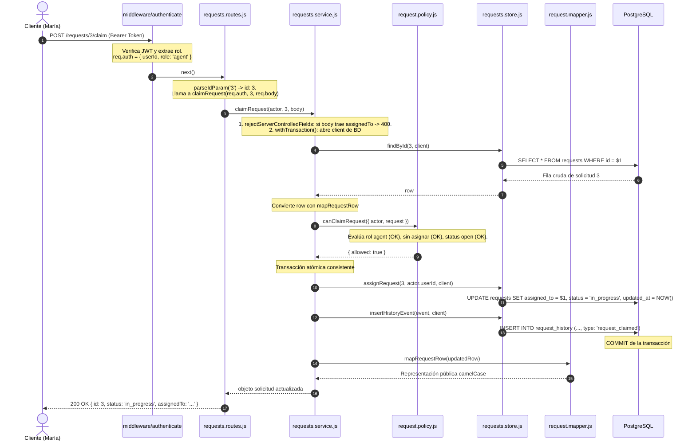

# Evitar la sobrearquitectura (con IA)

**Clasificación:** lectura interna y laboratorios · **Dificultad:** media · **Tiempo estimado:** 9 minutos · **Sección:** Estructura mínima

---

## 1. Introducción y la regla del problema presente

Los asistentes de IA tienen un sesgo estructural: fueron entrenados con millones de repositorios empresariales y libros de arquitectura donde abundan patrones complejos (arquitectura hexagonal, Clean Architecture, CQRS, repositorios genéricos, DTOs y Domain Events). Cuando se les pide diseñar una solución, su tendencia natural es proyectar esa literatura de libro incluso para problemas que caben perfectamente en cinco archivos.

La solución no es rechazar la IA, sino **dirigirla mediante restricciones explícitas**.

### La regla del problema presente
> **Cada archivo, capa o interfaz nueva se justifica únicamente con un problema que existe hoy y duele hoy.**

* **Problema presente (Justificado):** Separar `request.policy.js` permite testear la matriz de negocio (5 combinaciones de roles y estados) con objetos planos en memoria en 1 milisegundo, sin levantar PostgreSQL, sin Express y sin tokens JWT.
* **Problema imaginado (Sobrearquitectura):** Crear una interfaz `IRequestRepository` con una única implementación `PostgresRequestRepository` bajo la excusa de *"¿y si cambiamos de base de datos a MongoDB o DynamoDB?"*. Mientras no exista una segunda base de datos real, es indirección innecesaria: obliga al desarrollador a saltar entre archivos y añade ruido cognitivo sin aportar ningún valor hoy.

*"Podría servir después"* no es un argumento técnico válido: es pagar un costo certero hoy (tiempo de lectura, navegación, depuración y mantenimiento) por un beneficio hipotético que probablemente nunca ocurra. Si ese momento llega, desacoplar una capa en un módulo limpio y testeado es rápido y seguro.

---

## 2. Cinco archivos. Ni uno más.

Para el módulo de `requests`, la estructura mínima y completa consta de exactamente cinco archivos (más el mapper preexistente):

| Archivo | Conoce | JAMÁS conoce |
| :--- | :--- | :--- |
| `requests.routes.js` | HTTP: params, body, query, status de respuesta | SQL, consultas a base de datos |
| `requests.service.js` | Pasos del caso de uso, transacciones, coordinación | Objetos `req` / `res` / Express |
| `requests.store.js` | SQL parametrizado, nombres de columnas, queries | Códigos de estado HTTP (200, 404, etc.) |
| `request.policy.js` | Reglas puras sobre objetos planos `{ actor, request }` | Express, HTTP, base de datos / PostgreSQL |
| `request-status.js` | Estados válidos y matriz de transiciones de ciclo de vida | Todo lo demás (sin I/O, sin frameworks) |
| `request.mapper.js` | Traducción entre filas de BD (`snake_case`) y contrato público (`camelCase`) | Permisos, SQL, peticiones HTTP |

### La clave de la columna "JAMÁS"
Cada "jamás" es una **frontera verificable y automatizable**:
* El validador (`validate:class-08`) comprueba textualmente que `requests.routes.js` no tenga palabras clave de SQL ni llamadas al `pool`.
* Comprueba que `requests.service.js` no importe Express ni manipule `req`/`res`.

> *"La estructura correcta es la mínima que hace el cambio comprensible — no la máxima que impresiona."*

---

## 3. Las cinco tarjetas IA del taller

Para evitar que la IA sobrearquitecture el sistema, se utilizan cinco tarjetas con directivas de análisis y restricciones prohibitivas:

### Tarjeta 1: Reducir la propuesta (Anti-sobrearquitectura)
```text
Propusiste N capas/archivos para este cambio.
Para cada uno responde:
1. ¿Qué problema PRESENTE resuelve (no hipotético)?
2. ¿Qué costo agrega al lector?
Elimina de tu propia propuesta todo lo que no resuelva un problema presente y muestra la versión mínima.
```

### Tarjeta 2: Clasificar (Análisis de responsabilidades)
```text
Aquí va un handler.
Clasifica cada bloque en:
HTTP / aplicación / negocio / persistencia / presentación / observabilidad.
NO propongas refactor todavía: solo el mapa.
```

### Tarjeta 3: Detectar acoplamiento
```text
¿Qué sabe este archivo que no le corresponde?
Lista cada detalle ajeno (columnas, status, req/res) y di a qué capa pertenece.
No reescribas nada.
```

### Tarjeta 4: Planificar pasos (Refactor seguro)
```text
Propón un plan de refactor en pasos PEQUEÑOS y REVERSIBLES.
Después de cada paso la suite debe seguir verde.
Prohibido: cambiar rutas, status, bodies o permisos.
```

### Tarjeta 5: Revisar el refactor (Auditoría de diff)
```text
Aquí va mi diff de refactor. Busca cambios OBSERVABLES accidentales:
rutas, status, bodies, permisos, códigos de error.
Lista cada uno con su línea. No sugieras mejoras de estilo.
```

**El patrón común:** Todas las tarjetas exigen **análisis y diagnóstico con prohibiciones explícitas**, no código impulsivo. El desarrollador decide y programa; la IA asiste en la clasificación y revisión.

---

## 4. Lab 1: Revisor de sobrearquitectura (Poda de propuestas de IA)

A continuación se analizan las propuestas típicas de una IA frente al caso de uso de `claimRequest`, aplicando el criterio de poda:

| # | Propuesta de la IA | Decisión | Justificación técnica |
| :-: | :--- | :-: | :--- |
| 1 | `domain/entities/Request.js`: Clase con getters y setters que envuelve la fila de la BD. | **PODAR** | En JavaScript moderno, un objeto plano (`POJO`) es suficiente. Agregar clases con getters/setters añade sobrecarga de instanciación y complejidad sin resolver ningún problema de negocio presente. |
| 2 | `domain/policies/request.policy.js`: Funciones puras que evalúan `{ actor, request }`. | **MANTENER** | Resuelve un problema crítico presente: permite testear toda la matriz de permisos y reglas de estado sin depender de I/O, base de datos ni tokens JWT en submilisegundos. |
| 3 | `infrastructure/repositories/RequestRepository.interface.js`: Interfaz abstracta para el repositorio. | **PODAR** | En JavaScript (y sin múltiples implementaciones de almacenamiento), una interfaz abstracta añade indirección vacía. `requests.store.js` cumple el rol directamente. |
| 4 | `application/use-cases/ClaimRequestUseCase.js`: Clase dedicada exclusivamente a ejecutar el método `claim`. | **PODAR** | Una clase para un solo método fragmenta la navegación. Una función exportada dentro de `requests.service.js` agrupa la coordinación del módulo con máxima claridad. |
| 5 | `application/dto/ClaimRequestDTO.js`: Clase/esquema DTO para validar el body de entrada del claim. | **PODAR** | El endpoint de claim no requiere body (la identidad viene del token JWT). Únicamente se rechaza si envían `assignedTo` en el body mediante `rejectServerControlledFields`, lo cual se resuelve con una línea en el service. |
| 6 | `infrastructure/events/EventBus.js`: Bus de eventos en memoria para notificar `RequestClaimedEvent`. | **PODAR** | No existe ningún consumidor asíncrono o suscriptor secundario en el sistema. El historial se escribe sincrónicamente en la misma transacción PostgreSQL vía `insertHistoryEvent`. |
| 7 | `container/dependency-injection.js`: Contenedor IoC para inyectar store y logger en el servicio. | **PODAR** | Los módulos ESM nativos (`import`/`export`) ya proporcionan desacoplamiento estático y testeabilidad. La inyección dinámica en este contexto es sobreingeniería. |
| 8 | `requests.store.js`: Funciones SQL parametrizadas que operan sobre la tabla `requests`. | **MANTENER** | Resuelve el aislamiento de persistencia: previene que la ruta o el servicio conozcan SQL o detalles de PostgreSQL. |

---

## 5. Lab 2: Recorrido por las capas (El viaje de `POST /requests/3/claim`)

Flujo paso a paso cuando María (agente con token JWT válido) reclama la solicitud 3 (en estado `open` y sin asignar):



### Qué decide y qué NO decide cada capa:
1. **`middleware/authenticate`**:
   * *Decide:* Si el token es criptográficamente válido y quién es el usuario (`req.auth`).
   * *NO decide:* Si la solicitud existe o si María tiene permiso para reclamarla.
2. **`requests.routes.js`**:
   * *Decide:* Traducir parámetros HTTP (`parseIdParam`), invocar al servicio y retornar el status 200 con JSON.
   * *NO decide:* Ninguna regla de negocio ni ejecuta consultas SQL.
3. **`requests.service.js`**:
   * *Decide:* Orquestar la secuencia, iniciar la transacción, rechazar campos prohibidos del body y coordinar asignación con historial.
   * *NO decide:* No manipula directamente `req` ni `res`, ni escribe SQL directo.
4. **`requests.store.js`**:
   * *Decide:* Ejecutar las sentencias SQL parametrizadas (`SELECT`, `UPDATE`, `INSERT`) sobre el cliente de transacción.
   * *NO decide:* Si la transición de estado es válida ni qué código HTTP devolver.
5. **`request.policy.js`**:
   * *Decide:* Regla pura: si un agente puede reclamar la solicitud en base a sus propiedades (`allowed: true / false`).
   * *NO decide:* No conoce SQL, no traduce a códigos HTTP 403 o 409, no toca la base de datos.
6. **`request.mapper.js`**:
   * *Decide:* Formatear los nombres de columna de BD (`assigned_to`) a claves camelCase públicas (`assignedTo`) y ocultar metadatos internos.
   * *NO decide:* Autorización ni acceso a datos.

---

## 6. Preguntas para verificar la lectura

### 1. ¿Por qué una interfaz con una sola implementación es un costo neto?
Una interfaz existe para desacoplar a un consumidor de múltiples implementaciones posibles (polimorfismo o intercambio en tiempo de ejecución/testing). Cuando existe **una sola implementación concreta**, la interfaz no proporciona ningún beneficio operativo:
* No intercambia nada real hoy.
* Obliga a cualquier desarrollador que lea o depure el código a hacer un salto mental y de archivo adicional.
* Duplica el mantenimiento de firmas de métodos.
Representa un costo de navegación y mantenimiento presente por un beneficio puramente hipotético.

### 2. ¿Qué convierte a la policy en estructura justificada y al EventBus en sobrearquitectura?
* **La Policy está justificada** porque resuelve un **problema real y doloroso hoy**: probar una matriz de 5 casos de negocio (roles, estados terminales, solapamientos) en milisegundos sin necesidad de levantar PostgreSQL, configurar migraciones, crear registros de prueba ni generar tokens JWT.
* **El EventBus es sobrearquitectura** porque resuelve un **problema que no existe hoy**: actualmente no hay suscriptores secundarios ni consumidores asíncronos que necesiten reaccionar al evento de reclamo. La asignación y el registro del historial deben ocurrir de forma atómica y sincrónica dentro de la misma transacción PostgreSQL; introducir un EventBus añadiría complejidad asíncrona, riesgo de inconsistencia eventual y dificultad de rastreo sin resolver ninguna necesidad actual.

### 3. ¿Qué tienen en común las cinco tarjetas?
Todas las tarjetas comparten un principio fundamental: **exigen análisis diagnóstico con prohibiciones explícitas antes de emitir código**.
* Dirigen a la IA a clasificar, detectar acoplamientos, justificar cada pieza contra problemas presentes o buscar regresiones observables en los diffs.
* Prohíben expresamente cambiar rutas, alterar códigos de estado, inventar capas o modificar contratos observables sin una orden directa.
* Mantienen al desarrollador al mando del diseño y evitan que la IA sobrecargue el código con patrones de libro innecesarios.

---

## 7. Actividad práctica: Poda del diseño de Claim

### Paso 1: Lo que la IA suele proponer como "Arquitectura Ideal" (Sobrearquitectura)
Una propuesta típica sin restricciones genera:
1. `domain/entities/Request.js` (Entidad con encapsulamiento, getters/setters y métodos de dominio).
2. `domain/entities/Agent.js` (Entidad de usuario agente).
3. `domain/events/RequestClaimedEvent.js` (Objeto de evento de dominio).
4. `domain/repositories/IRequestRepository.js` (Interfaz de persistencia).
5. `domain/repositories/IHistoryRepository.js` (Interfaz para el historial).
6. `application/use-cases/ClaimRequestUseCase.js` (Servicio de aplicación exclusivo para el claim).
7. `application/dto/ClaimRequestInputDTO.js` (DTO de entrada).
8. `application/dto/ClaimRequestOutputDTO.js` (DTO de salida).
9. `infrastructure/repositories/PostgresRequestRepository.js` (Implementación con TypeORM o similar).
10. `infrastructure/repositories/PostgresHistoryRepository.js` (Implementación SQL).
11. `infrastructure/bus/InMemoryEventBus.js` (Bus de eventos).
12. `infrastructure/http/controllers/ClaimRequestController.js` (Controlador HTTP).

### Paso 2: Aplicación de la Tarjeta de Reducción
Al contrastar cada elemento con la pregunta: *¿Qué problema PRESENTE resuelve y qué costo agrega al lector?*:

1. ¿Se necesitan dos repositorios separados y sus interfaces? **No.** Con un único almacén (`requests.store.js`) que maneje solicitudes e historial en la misma transacción mediante funciones SQL puras, se elimina el 70% del código accesorio.
2. ¿Se necesitan entidades de clase `Request` y DTOs de entrada y salida? **No.** El claim no recibe body; usar objetos literales (`POJO`) y un mapper funcional (`request.mapper.js`) resuelve la serialización de forma directa y legible.
3. ¿Se necesita un EventBus y UseCase por clase? **No.** `claimRequest` es una función de 25 líneas en `requests.service.js` que coordina la transacción atómica.

### Paso 3: Elementos que sobreviven (Estructura mínima: 5 archivos)
Únicamente sobreviven los elementos que resuelven una responsabilidad real del problema presente:
1. **`requests.routes.js`**: Atiende la petición HTTP en `POST /:id/claim` y delega en el servicio.
2. **`requests.service.js`**: Orquesta el caso de uso y asegura la atomicidad con `withTransaction`.
3. **`requests.store.js`**: Ejecuta las queries SQL de actualización e inserción de historial con el mismo cliente.
4. **`request.policy.js`**: Evalúa de manera pura si el actor puede reclamar la solicitud (`canClaimRequest`).
5. **`request-status.js`**: Provee los estados canónicos y transiciones.
*(más `request.mapper.js` para asegurar la salida camelCase requerida por el contrato)*.

**Conclusión:** De una propuesta inflada de 12 clases y capas, sobreviven únicamente **5 archivos funcionales y cohesivos**, logrando una solución verificable, con 53/53 pruebas en verde y 13/13 checks del validador aprobados.
